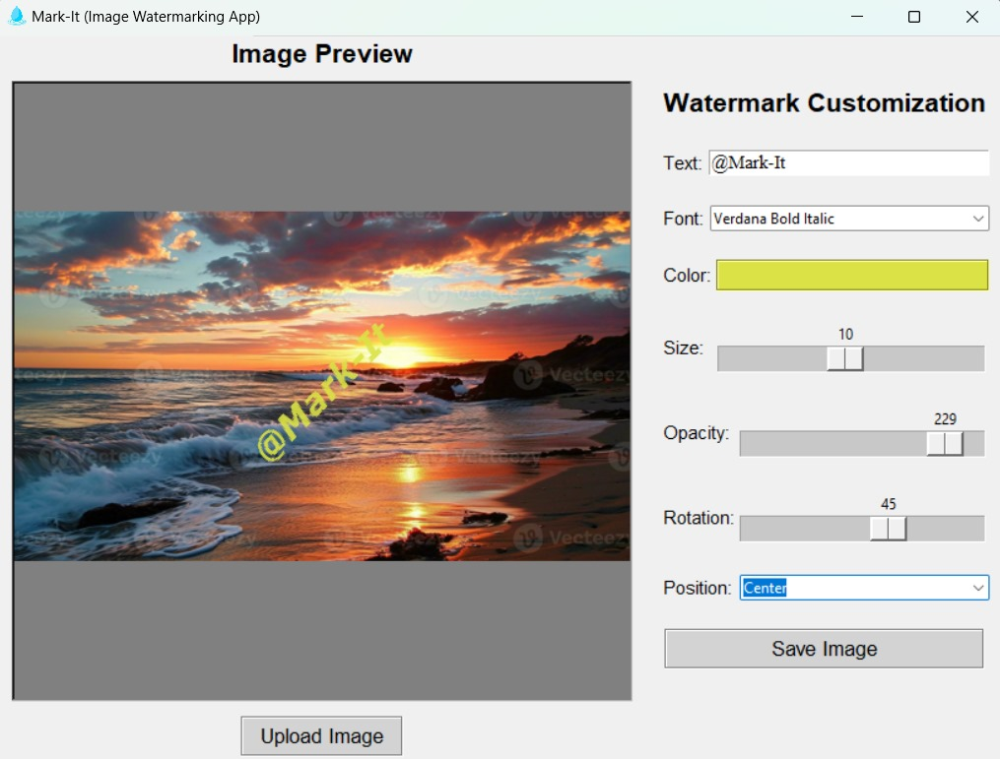

# Libraries Used:
1. Tkinter
2. Pillow

# Instructions:
1. Inside PyCharm or VSCode, execute the following command in the terminal before you run the app:

<pre>pip install -r requirements.txt</pre>

The file 'requirements.txt' contains the needed package(s) that you should install to be able to use the app.

# App Screenshot:

Feel free to make any suggestions!
Enjoy! Good luck :)